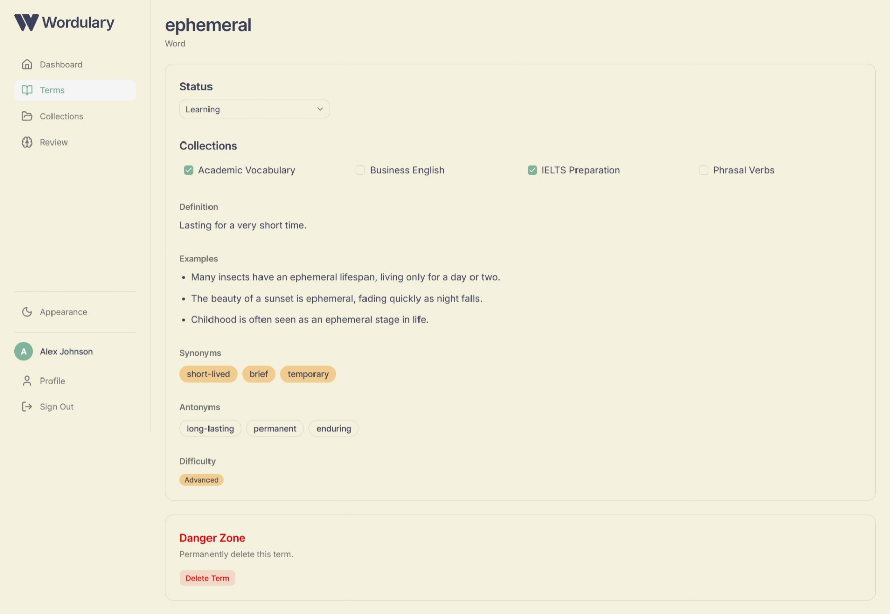
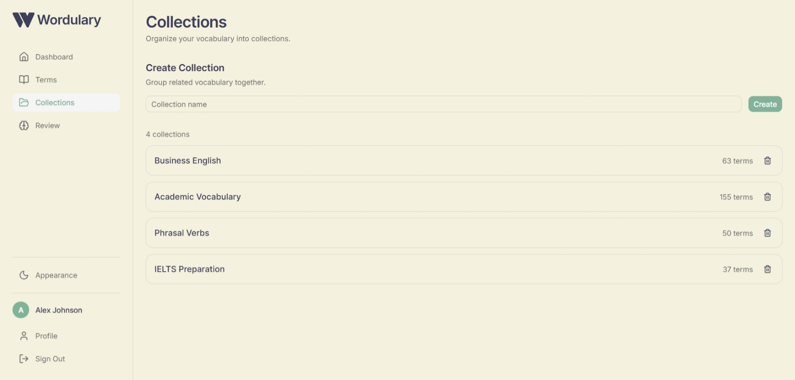

# Wordulary

<p align="center">
  
</p>

> AI-powered vocabulary learning built for focused study.

Wordulary is an AI-powered vocabulary learning application that helps learners build a personal vocabulary library, organize words into collections, and generate detailed learning content, including definitions, examples, synonyms, antonyms, and difficulty levels.

Built with Next.js, Supabase, and Google's Gemini API, Wordulary focuses on a clean, distraction-free experience that makes learning new words enjoyable.

[](https://nextjs.org/)
[](https://react.dev/)
[](https://www.typescriptlang.org/)
[](https://tailwindcss.com/)
[](https://supabase.com/)
[](https://ai.google.dev/)
[](https://vercel.com/)

---

## 🌐 Demo

**Live Demo:** [Try Wordulary](https://wordulary.vercel.app/)

Use the demo account below to explore the application without creating an account.

- **Email:** demo.testin9@gmail.com
- **Password:** WordularyDemo!2026

> The demo account contains sample vocabulary and collections for testing the main features.

---

## 📑 Table of Contents

- [Features](#-features)
- [Screenshots](#-screenshots)
- [Tech Stack](#-tech-stack)
- [Getting Started](#-getting-started)
- [Project Structure](#-project-structure)
- [Roadmap](#-roadmap)

---

## ✨ Features

### 📚 Vocabulary Management

- Add and manage your personal vocabulary library.
- Organize terms into custom collections.
- Track each term with customizable learning statuses.

### 🤖 AI-Powered Learning

- Generate rich vocabulary content using Google Gemini.
- Generate AI-powered definitions, example sentences, synonyms, and antonyms.
- Receive AI-generated difficulty levels for each term.

### 🎨 User Experience

- Clean, distraction-free interface.
- Fully responsive across mobile, tablet, and desktop.
- Light and dark mode support.
- Dynamic page titles and loading skeletons.

### 🔐 Authentication

- Secure Google sign-in with Supabase Auth.
- User-specific data protected with Row Level Security (RLS).

---

## 📸 Screenshots

### Landing Page


### Dashboard

<table>
<tr>
<td align="center">
<b>Light Mode</b><br><br>

</td>

<td align="center">
<b>Dark Mode</b><br><br>

</td>
</tr>
</table>

### AI Term Details



### Collections



---

## 🛠 Tech Stack

### Frontend

- Next.js 16
- React 19
- TypeScript
- Tailwind CSS v4
- shadcn/ui

### Backend & Database

- Supabase
- PostgreSQL
- Supabase Authentication

### AI

- Google Gemini

### Deployment

- Vercel

---

## 🚀 Getting Started

### Prerequisites

- Node.js 22+
- npm

### Installation

```bash
git clone https://github.com/chmndu/wordulary.git

cd wordulary

npm install

npm run dev
```

### Environment Variables

Create a `.env.local` file:

```env
NEXT_PUBLIC_SUPABASE_URL=

NEXT_PUBLIC_SUPABASE_ANON_KEY=

NEXT_PUBLIC_SITE_URL=

GEMINI_API_KEY=
```

---

## 📁 Project Structure

```text
src/
├── app/
├── actions/
├── components/
├── lib/
├── types/
└── ...
```

---

## 🗺 Roadmap

### Completed

- [x] AI-generated vocabulary content
- [x] Collections
- [x] Responsive dashboard
- [x] Light & Dark mode

### Planned

- [ ] Vocabulary import improvements
- [ ] Dictionary API integration
- [ ] Reading mode with one-click word collection
- [ ] Spaced repetition
- [ ] Flashcards
- [ ] User profile settings

---

Built as a portfolio project showcasing modern full-stack web development with AI.